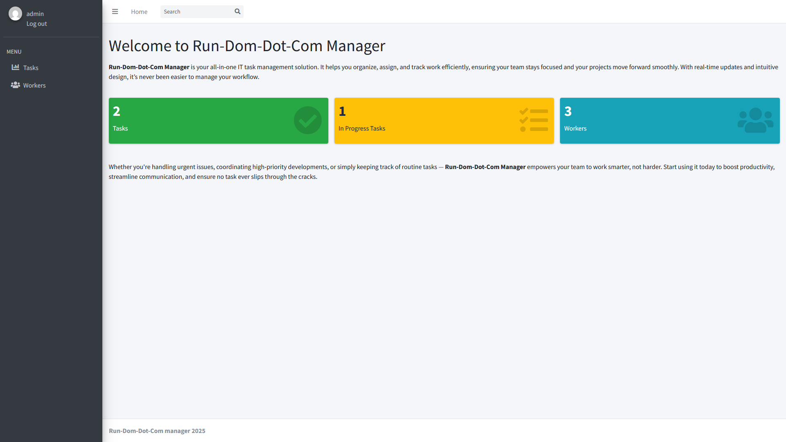

## RunDomDotCom Task Manager
> Simple Django project to manage tasks in a small business team 

RDDC Task Manager allows you manage tasks in your company's workflow with 
CRUD operations on Worker (inherits AbstractUser) and Task models.

## Installation
Python3 must be already installed

```shell
git clone https://github.com/pr-ruslan/task-manager
awesome-project start
cd task_manager
python3 -m venv .venv
source venv/bin/activate
pip install -r requirements.txt
python3 manage.py runserver #starts django server
```
## Features
* Authentication functionality for Worker/User
* Managing workers nad tasks from website interface
* Flexible filtering for created workers and tasks

## Contributing
If you'd like to contribute, please fork the repository and use a feature
branch. Pull requests are warmly welcome.

## Demo
 

## Links
- Check it up https://rddc-task-manager.onrender.com/
    Test-user login: bob
    Test-user password: 123
- Repository: https://github.com/pr-ruslan/task-manager

## Licensing
The code in this project is licensed under MIT license.
